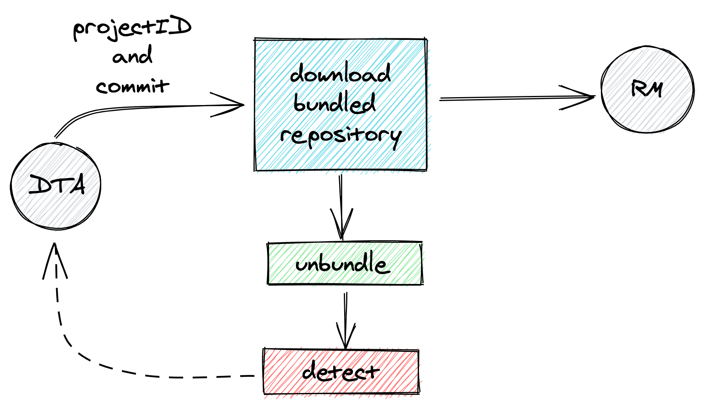
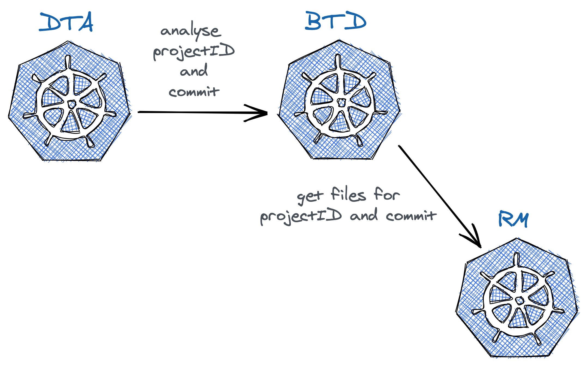

# BTD - Build Tool Detector

Microservice that detects the build tool used by a project. The detection is done via predefined file names for each build tool in the config.yml file.

Currently, the following build tools are supported: **maven**, **gradle**, **sbt**, **npm**.

## How it works?

## Integrations

